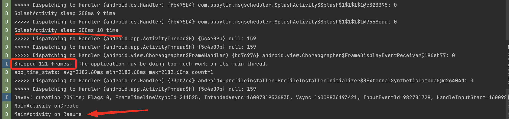
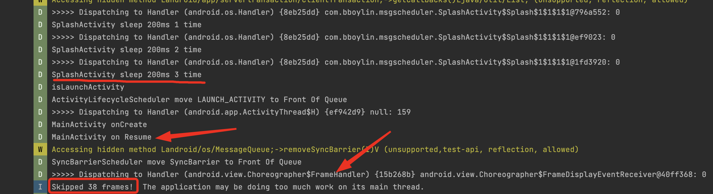

### 利用消息调度机制优化启动速度和首帧绘制

大型App的启动通常有较多任务需要执行，有时候个别任务可能在一些关键Message之前执行，例如首页Activity的生命周期Message，或者UI绘制的SyncBarrier消息, 从而影响启动的性能表现。

可以通过人为干预消息队列，将需要优先执行的Message提前执行，来达到提升启动速度和首帧耗时的功能。

在Application的onCreate之后会跳转到第一个Activity（闪屏或者首页），那么在Application的onCreate中可以开始hook消息队列，通过Looper的printer获取消息的执行时机，在每个消息执行之后遍历一次消息队列，找到其中启动Activity的message，拷贝之后插入消息队列队首，同时删除原message，从而让启动activity的消息优先执行。

判断是不是启动Activity的消息需要注意兼容9.0前后两种不同实现：
```kotlin
        private var method: Method? = null

        fun isLaunchActivity(msg: Message): Boolean {
            return if (Build.VERSION.SDK_INT > Build.VERSION_CODES.O_MR1) {
                if (msg.what === EXECUTE_TRANSACTION && msg.obj != null) {
                    try {
                        if (null == method) {
                            val clazz =
                                Class.forName("android.app.servertransaction.ClientTransaction")
                            method = clazz.getDeclaredMethod("getCallbacks")
                            method!!.isAccessible = true
                        }
                        val list = method!!.invoke(msg.obj) as List<*>
                        if (list.isNotEmpty()) {
                            val isLaunchActivity =
                                list[0]!!.javaClass.name.endsWith(".LaunchActivityItem")
                            if (isLaunchActivity) {
                                Log.d(TAG, "isLaunchActivity")
                            }
                            return isLaunchActivity
                        }
                    } catch (e: Exception) {
                        Log.e(TAG, "[ActivityThreadHacker isLaunchActivity] %s", e)
                    }
                }
                msg.what === LAUNCH_ACTIVITY
            } else {
                msg.what === LAUNCH_ACTIVITY || msg.what === RELAUNCH_ACTIVITY
            }
        }
```

而如何将这个消息提到队首主要是对MessageQueue和Message的反射和链表操作（前一个节点的next指向要删除节点的下一个节点）, 可以自己看代码，不加赘述。

而对于SyncBarrier，它是UI绘制的触发器，MessageQueue在next方法中会取出当下需要执行的消息，如果遇到SyncBarrier，就会遍历队列，找到第一个异步消息（UI绘制都是异步消息）执行。而SyncBarrier通常是在viewrootimpl的scheduleTraversal中插入到主线程消息队列，然后在执行到doTraversal真正进行UI刷新的时候removeSyncBarrier。因为Activity的UI是在onResume之后才attach到window上的，可以在第一个Activity的onResume中接管消息队列，把队列里的SyncBarrier提到队首，让UI绘制优先执行。

判断SyncBarrier很简单，target为null就是了。而删除原消息可以通过反射removeSyncBarrier方法，传入原SyncBarrier消息的token。
```kotlin
    override fun isHighPriorityMessage(message: Message): Boolean {
        return message.target == null
    }

    override fun moveMessageToFrontOfQueue(preMessage: Message, targetMessage: Message) {
        val newBarrier = Message.obtain(targetMessage)
        removeSyncBarrier(newBarrier.arg1)
        handler.sendMessageAtFrontOfQueue(newBarrier)
        // target置null
        newBarrier.target = null
        Log.d(TAG, "SyncBarrierScheduler move SyncBarrier to Front Of Queue")
    }

    private fun removeSyncBarrier(token: Int) {
        if (removeSyncBarrierMethod == null) {
            removeSyncBarrierMethod =
                MessageQueue::class.java.getDeclaredMethod("removeSyncBarrier", Int::class.java)
            removeSyncBarrierMethod!!.isAccessible = true
        }

        removeSyncBarrierMethod!!.invoke(looper.queue, token)
        Log.d(TAG, "removeSyncBarrier success")
    }

```

在App模块我通过连续post 10个delay 200ms的消息来模拟启动过程耗时操作，优化之前生命周期和首帧都在这10个msg执行完成之后：



优化之后：

